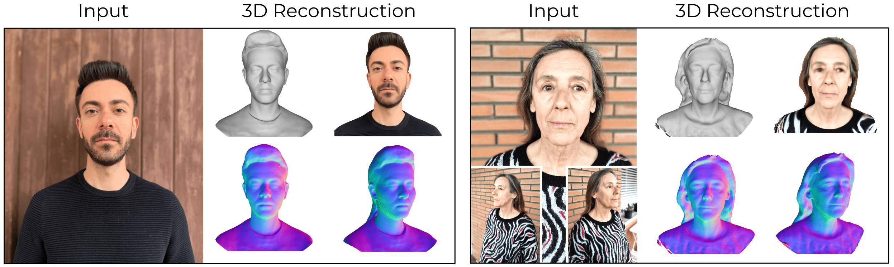
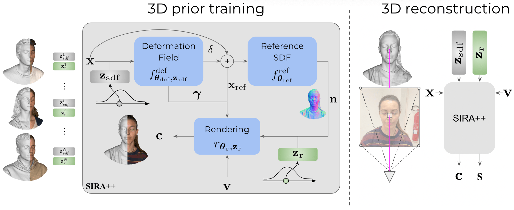

## Abstract

Recent advancements in learning techniques that employ coordinate-based neural representations have yielded remarkable results in multi-view 3D reconstruction tasks.  However, these approaches often require a substantial number of input views (typically several tens) and computationally intensive optimization procedures to achieve their effectiveness. In this paper, we address these limitations specifically for the problem of few-shot full 3D head reconstruction.  We accomplish this by incorporating a probabilistic shape and appearance prior into coordinate-based representations, enabling faster convergence and improved generalization when working with only a few input images (even as low as a single image). During testing, we leverage this prior to guide the fitting process of a signed distance function using a differentiable renderer. By incorporating the statistical prior alongside parallelizable ray tracing and dynamic caching strategies, we achieve an efficient and accurate approach to few-shot full 3D head reconstruction.

Moreover, we extend the H3DS dataset, which now comprises 60 high-resolution 3D full-head scans and their corresponding posed images and masks, which we use for evaluation purposes. By leveraging this dataset, we demonstrate the remarkable capabilities of our approach in achieving state-of-the-art results in geometry reconstruction while being an order of magnitude faster than previous approaches. 

## Method

This work introduces a novel approach designed for high-fidelity full 3D head reconstruction from a few input images with associated masks and camera poses. Our method leverages a statistical shape and appearance priors encoded in low-dimensional latent spaces. The method employs coordinate-based neural representations to model geometry as a Signed Distance Function (SDF) and head appearance through a rendering decoder. The Surface Appearance Statistical Model (SA-SM) is pretrained using a dataset of 10,000 high-resolution head scans, capturing geometric and visual variabilities. For geometry recovery, the model optimizes latents and network parameters using a differentiable renderer guided by a learned statistical prior, enabling efficient and high-fidelity reconstructions from as few as one input image. Key advancements include a progressive optimization strategy, selective sampling, and dynamic caching, resulting in a 10x efficiency improvement.



## Results

SIRA++ demonstrates state-of-the-art performance in few-shot and in-the-wild 3D head reconstruction tasks. Experimental evaluation on the expanded H3DS dataset (60 high-resolution full-head scans) and the 3DFAW dataset highlights the robustness of the method in scenarios ranging from single-view to multi-view setups. Quantitatively, SIRA++ outperforms previous methods like H3D-Net and NeuS2 across all view configurations, with notable improvements in surface reconstruction accuracy and computational efficiency. It achieves significant reductions in reconstruction error, particularly in challenging one-shot regimes, while capturing fine geometric details, including facial features, hair, and upper body clothing. Qualitative results further demonstrate SIRA++'s ability to retain individual identity and high-frequency anatomical details, even in the most challenging single-view scenarios. A user study confirms superior visual fidelity compared to state-of-the-art techniques, with participants consistently rating SIRA++ as the most realistic and detailed reconstructions.

<p align="center">
  <video controls width="800">
    <source src="assets/videos/results.webm" type="video/webm">
  </video>
</p>

## BibTeX

```
@article{caselles2023implicit,
  title={Implicit Shape and Appearance Priors for Few-Shot Full Head Reconstruction},
  author={Caselles, Pol and Ramon, Eduard and Garcia, Jaime and Triginer, Gil and Moreno-Noguer, Francesc},
  journal={arXiv preprint arXiv:2310.08784},
  year={2023}
}
```
